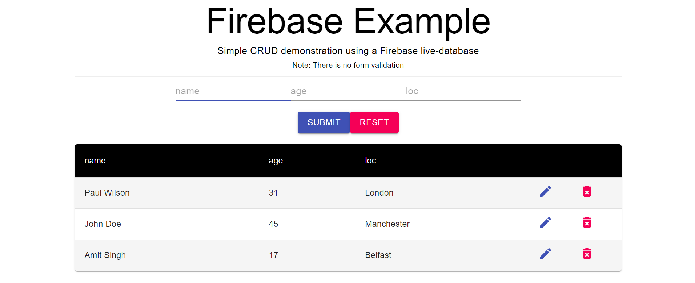

# Basic Firebase demonstration

This repo is nothing more than evidence of my knowledge of using Firebase within a React application.

It was not designed nor is intended to be hosted.

As such, there is no form validation.

Clicking an edit button (blue pen) fills the form with the row information and upon submit updates the Firebase entry.

All button actions result with autofocus to the name field.

MIT License.

Requirements:
1. Correct firebase variables located within env.local
2. Firebase collection of "items" existing

Visual example:

